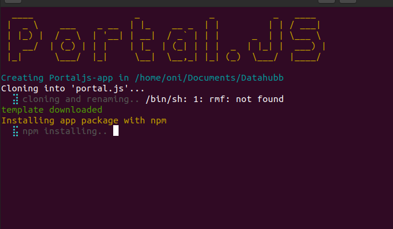

## Create Portal App



create portal app helps bootstrap Portal js app.

To use, clone the repo and run the following command to make it global

```bash
$ cd creatportal

$ npm install -g
```

The command is now available in the global scope. To bootstrap a Portal js app

```bash
$ createportal Dataportal --use-npm

```

The above create a portal js ap with the name Portal and install package using npm. To use yarn

```bash
$ createportal Dataportal --use-yarn
```
